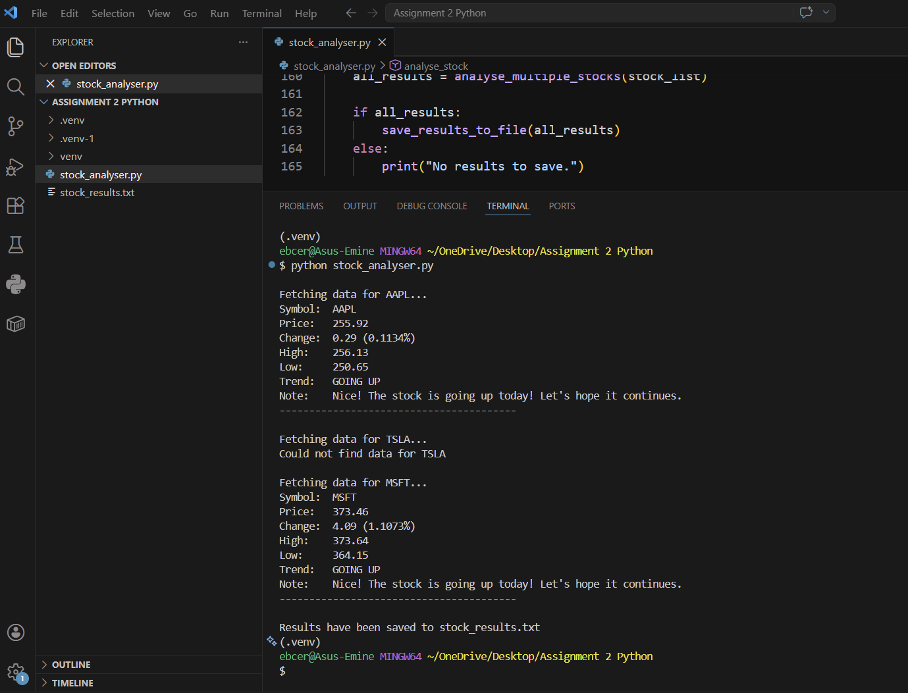

# Stock Analyser - Python API Project

This project is a simple console application that uses the Alpha Vantage API to analyse stock data.

## What the program does

- Fetches stock data from an API
- Analyses whether the stock is going up or down
- Displays results in the console
- Saves the results into a text file

## How it works

The program uses the requests library to get data from the Alpha Vantage API in JSON format.  
This data is then processed using functions, loops, and conditionals.

- A **for loop** is used to analyse multiple stocks
- **if/else statements** are used to determine the trend (up or down)
- Results are stored in a **dictionary**
- The final results are written to a file using Python file handling

## Technologies used

- Python
- Alpha Vantage API
- requests library
- datetime module

## Setup instructions

1. Install requests (if not already installed):
pip install requests

2. Get a free API key from:
https://www.alphavantage.co

3. Add your API key in the code:
```python
API_KEY = "YOUR_API_KEY"
```

4. Run the program
python stock_analyser.py


## Output
The results are printed in the terminal
The results are also saved in a file called:
stock_results.txt

### Notes
The program uses write mode ("w") to create the file automatically if it does not exist.
If the file already exists, it will be overwritten.
Sometimes, certain stocks (like TSLA) may not return data. This is likely due to API limitations or temporary issues with the API response rather than an error in the code.

## Reflection
This project helped me understand how to work with APIs, process JSON data, and structure a Python program using functions and loops.

## Example Output

Here is an example of the program running:



